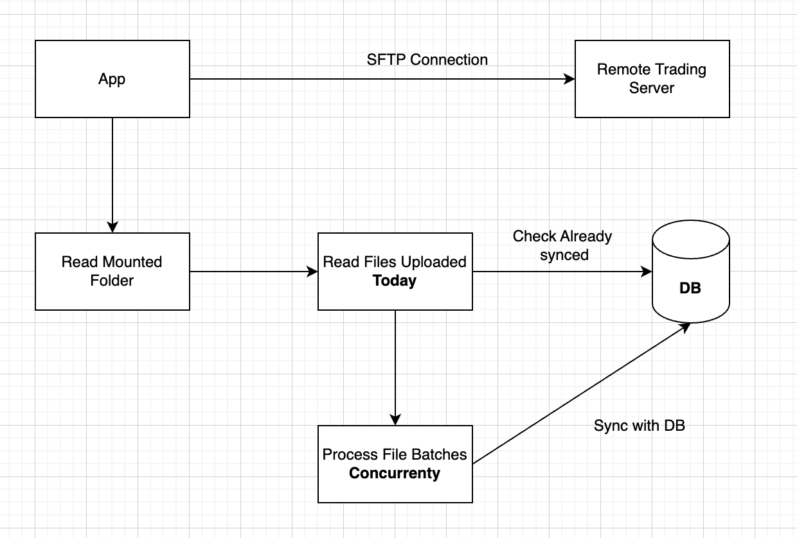
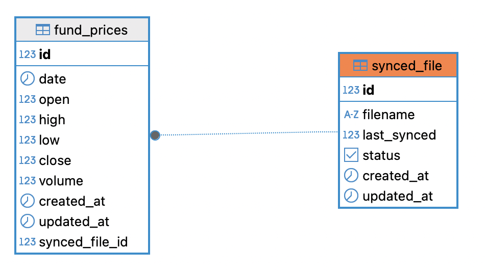

# 📊 sftpFundTrack

A system to securely connect to an SFTP server, read daily trading data (CSV files), and sync them into a database. Supports scheduled automation using cron or systemd.

---

## 🚀 Features

- 🔐 Secure SFTP connection
- 📁 Reads and processes CSV files daily
- 🛢️ Inserts trading data in your database
- 🕒 Automated with `cron` or `systemd`
- ☁️ (Optional) Rclone + S3 + Lambda architecture for serverless sync

---

## 🧱 Project Architecture

### 🔄 Daily File Sync and Processing Pipeline



---

## 📘 ERD – Entity Relationship Diagram



---

## ⏱️ Cronjob Setup

Run the script every 5 minutes using cron:

```cron
*/5 * * * * /usr/bin/node <ProjectFolderPath>/dist/index.js
```

### File Upload Flow: Remote Server → S3 → Lambda → Database

1. **Remote Server**: Puts a CSV or other data file in a watched directory.
2. **Rclone**: A cronjob or daemon runs `rclone` to sync new files to an **S3 bucket**.
3. **S3 Bucket**: Upon receiving a new file (`ObjectCreated` event), it triggers...
4. **Lambda Function**: Parses the CSV, validates the data, and syncs it to the **database**.
5. The whole process is **automated** and can run every few minutes.

## Run Unit Tests

``` yarn test ```